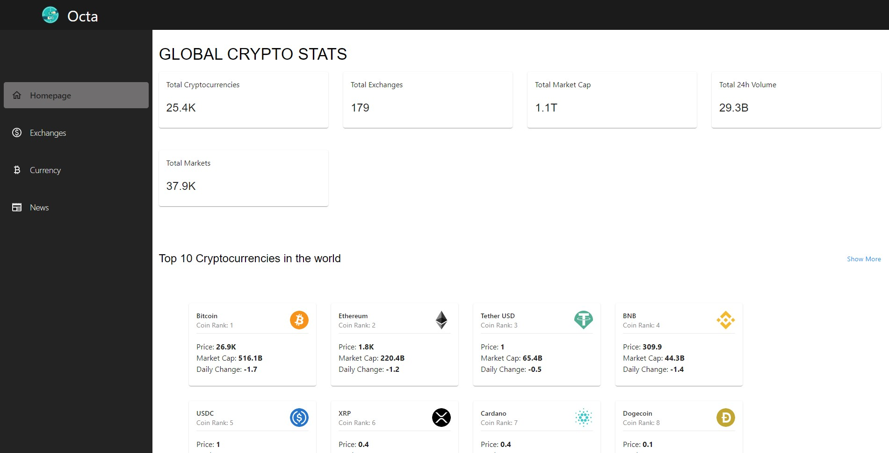
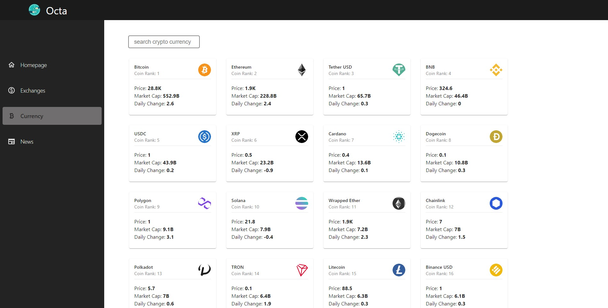
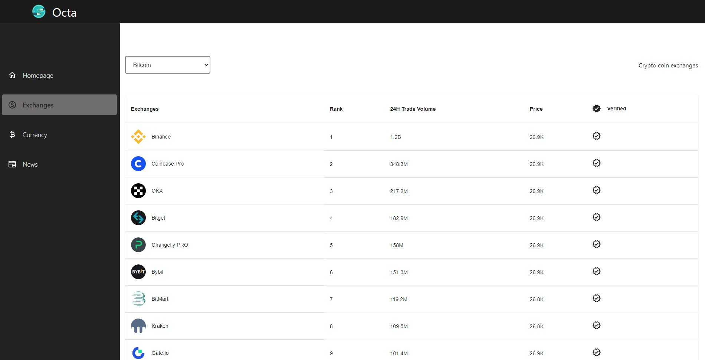
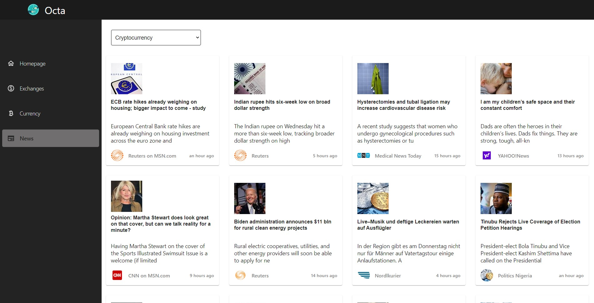
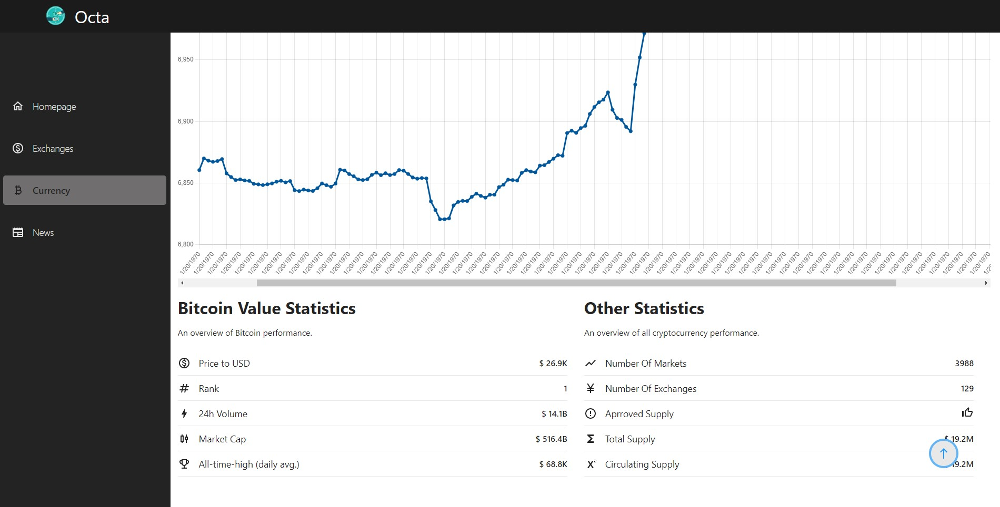

https://octabuild.netlify.app/

# Octa Crypto App

Octa cryptoApp was built to give information on the market performance of the different cryptocurrencies as well related news articles. This app utilizes chartJS to give a visual representation of statistical data to help influence purchase decisions. This project demonstrate my ability to use react, redux and RTK Query consume Api data. It also demonstrates my ability to use material UI and other skills listed above.

Users should be able to:

- See the ranking of each coin
- See coin market performance
- See related news for all cryptocurrencies
- See different coin exchanges and the performance of each coin in these exchanges

### Screenshot

### Links

- Solution URL: [https://octabuild.netlify.app/]
- Live Site URL: [https://octabuild.netlify.app/]

## My process

### Built with

- Semantic HTML5 markup
- CSS custom properties
- Flexbox
- CSS Grid
- Mobile-first workflow
- [React](https://reactjs.org/) - JS library
- [Material-UI](https://mui.com/material-ui) - For styles
- [Material-icons](https://mui.com/material-ui/material-icons/) - For icons
- [Redux](https://reactjs.org/) - JS library
- [RapidApi](https://rapidapi.com) - For coin information

Author
Website - Ugorji Victor E
Twitter - @ugorjivee
GitHub - @BlckTitan